# Diagram 4: UML Activity, from listing to student choice

**Type:** UML activity with swimlanes · **Scope:** the core workflow. A meal is verified, a student finds and chooses it, and a student report is handled.

```mermaid
%%{init: {"flowchart": {"curve": "step", "nodeSpacing": 40, "rankSpacing": 45, "padding": 14}, "themeVariables": {"edgeLabelBackground": "#656161", "fontSize": "12px", "lineColor": "#040404"}}}%%
flowchart TB
    ttl["<b>UML Activity diagram:<br/>from verified listing to student choice</b>"]:::title

    subgraph LA["<font color=#000000><b>ADMIN</b></font>"]
        direction TB
        tA[" "]:::ghost
        a0(( )):::start
        a1("Collect meal details<br/>from the vendor"):::act
        a2("Enter or edit<br/>the meal listing"):::act
        d1{"Details confirmed<br/>with vendor?"}:::dec
        a3("Verify the listing"):::act
        a4("Review the report"):::act
        d4{"Report valid?"}:::dec
        bA[" "]:::ghost
    end

    subgraph LS["<font color=#000000><b>SYSTEM</b></font>"]
        direction TB
        tS[" "]:::ghost
        s1("Save listing as DRAFT and<br/>close any open report as RESOLVED"):::act
        s2("Set VERIFIED, record date,<br/>show meal in the guide"):::act
        s4("Show matching meals"):::act
        s5("Record anonymous choice"):::act
        s6("Save report as OPEN and<br/>set meal FLAGGED"):::act
        s7("Set report DISMISSED and<br/>set meal VERIFIED"):::act
        e1((( ))):::stop
        e2((( ))):::stop
        bS[" "]:::ghost
    end

    subgraph LT["<font color=#000000><b>STUDENT</b></font>"]
        direction TB
        tT[" "]:::ghost
        t1("Open the guide"):::act
        t2("Set diet and<br/>maximum price filters"):::act
        t3("Open meal details"):::act
        d2{"Suits diet<br/>and budget?"}:::dec
        d3{"Information<br/>looks wrong?"}:::dec
        t4("Tap 'I chose this'"):::act
        t5("Submit a report"):::act
        bT[" "]:::ghost
    end

    ttl ~~~ LS
    
    a0 --> a1 --> a2 --> s1 --> d1
    d1 -->|"[not confirmed]"| a1
    d1 -->|"[confirmed]"| a3 --> s2 --> t1
    t1 --> t2 --> s4 --> t3 --> d2
    d2 -->|"[suits]"| t4 --> s5 --> e1
    d2 -->|"[does not suit]"| d3
    d3 -->|"[looks fine]"| t2
    d3 -->|"[looks wrong]"| t5 --> s6 --> a4 --> d4
    d4 -->|"[valid]"| a2
    d4 -->|"[not valid]"| s7 --> e2

    tA ~~~ a0
    tS ~~~ a0
    tT ~~~ a0
    e2 ~~~ bA
    e2 ~~~ bS
    e2 ~~~ bT

    classDef act fill:#fff,stroke:#000,stroke-width:1px,color:#000,font-size:12px
    classDef dec fill:#fff,stroke:#000,stroke-width:1px,color:#000,font-size:12px
    classDef start fill:#000,stroke:#d40000,stroke-width:2px
    classDef stop fill:#000,stroke:#d40000,stroke-width:3px
    classDef title fill:none,stroke:none,color:#000,font-size:15px
    classDef ghost fill:none,stroke:none,color:#fff
    style LT fill:#fff,stroke:#000,stroke-width:1px
    style LS fill:#fff,stroke:#000,stroke-width:1px
    style LA fill:#fff,stroke:#000,stroke-width:1px
    linkStyle default stroke:#000,stroke-width:1px
```

## Key

| Symbol | Meaning |
|---|---|
| Black circle with a red outline (top of the Admin lane) | Start node |
| Black circle inside a double red ring | End node (there are two possible endings) |
| Rounded rectangle | Action, performed by the role whose lane it sits in |
| Diamond | Decision; each outgoing arrow carries a `[guard]` |
| Arrow with right-angle bends | Order of the steps (control flow) |
| Column with a heading (STUDENT, SYSTEM, ADMIN) | Swimlane |

## The two endings

1. **Choice recorded:** the student found a meal that suits their diet and budget and tapped "I chose this".
2. **Report dismissed:** the admin found the report not valid, so the report is set to DISMISSED and the meal returns to VERIFIED.

## Notes

- A **valid** report sends the admin back to "Enter or edit the meal listing". Saving the corrected listing sets the meal to DRAFT and closes the report as RESOLVED, so the meal must be verified again. This matches the state machine (FLAGGED to DRAFT).
- If the meal does not suit the student and the information looks fine, the student goes back to change the filters.
- Time passes between "show meal in the guide" and "Open the guide".
- **Audience:** the team, admins who will verify data, and the instructor.
- **Risk reduced:** workflow gaps, such as having no path for wrong information.
