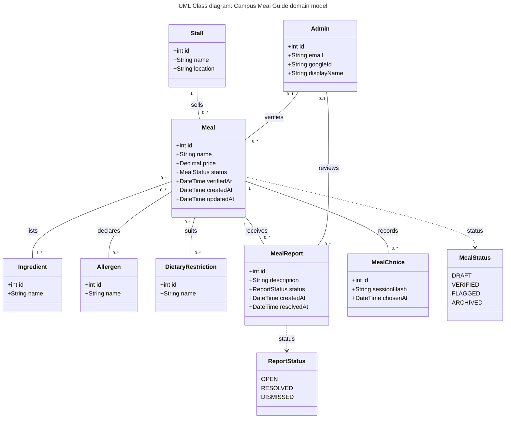

# Diagram 6: UML Class, Campus Meal Guide domain model

**Type:** UML class · **Scope:** 8 domain classes with typed attributes, multiplicity at both ends of every association, and an enumeration for each status field.

## Key

| Symbol | Meaning |
|---|---|
| Box with three parts | Class: name, then attributes (`+` = public, then type and name) |
| `<<enumeration>>` | A fixed set of allowed values |
| Plain line with a verb | Association; the multiplicity at each end counts the objects on **that** side |
| Dotted arrow | The attribute uses that enumeration as its type |

## Design decisions

- `Stall` is the class that holds vendor data. "Vendor" is only a data source in the MVP, not an actor.
- The `allergen-free` filter (M2) is handled as "exclude meals that declare allergen X", so allergens are a class of their own.
- `Meal.verifiedAt` and the `verifies` association give the "verified badge and date" in M4.
- `MealStatus` matches the state machine exactly. `ReportStatus` is the second status field.
- **Audience:** developers and database designers.
- **Risk reduced:** a wrong domain model, such as missing allergens or an unrecorded verifier.
