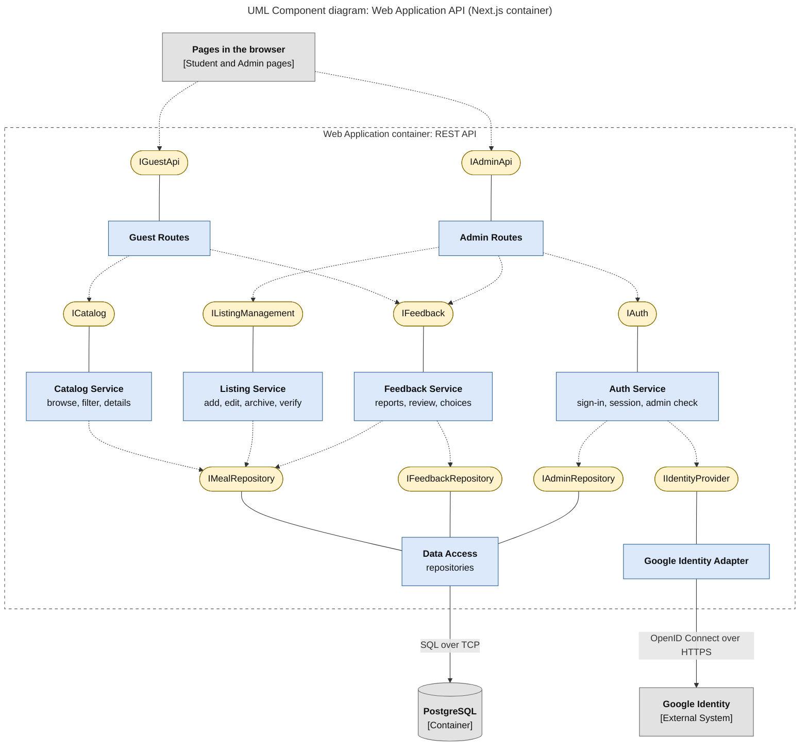

# Diagram 9: UML Component, Web Application API

**Type:** UML component · **Scope:** the API inside the Next.js Web Application container, with the interfaces each component provides and requires. Google Identity sits behind an adapter interface.

## Key

| Symbol | Meaning |
|---|---|
| Blue box `«component»` | A component inside the API |
| Yellow rounded shape | An interface (a named contract) |
| Solid line, component to interface | The component **provides** the interface |
| Dashed arrow, component to interface | The component **requires** the interface |
| Grey box | Outside this container |
| Labelled solid arrow | Runtime connection and its protocol |

## Notes

- Google Identity is reached only through `IIdentityProvider`, so Auth Service never depends on Google directly and can be tested with a fake.
- The database is reached only through the three repository interfaces provided by Data Access.
- **Audience:** back-end developers.
- **Risk reduced:** tight coupling to Google or to the database, which makes the code hard to test or change.
