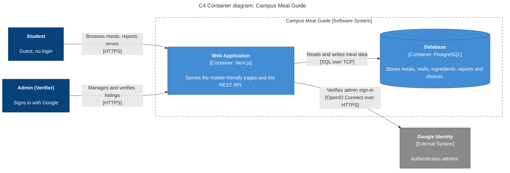

# Diagram 2: C4 Container, Campus Meal Guide

**Type:** C4 Level 2 (Container) · **Scope:** every separately deployable unit, its technology, and how the units talk.

**Next.js is drawn as one container:** the pages and the REST API are built and deployed together as a single web application.

## Key

| Shape / colour | Meaning |
|---|---|
| Dark blue box | Person |
| Light blue box `[Container: technology]` | A separately deployable unit and its technology |
| Cylinder | Data store |
| Grey box | External system |
| Dashed frame | System boundary |
| Arrow label | Intent, then `[protocol]` |

## Notes

- **Audience:** developers and whoever will deploy the system.
- **Risk reduced:** hidden deployable units, and unclear technology or protocol choices.
