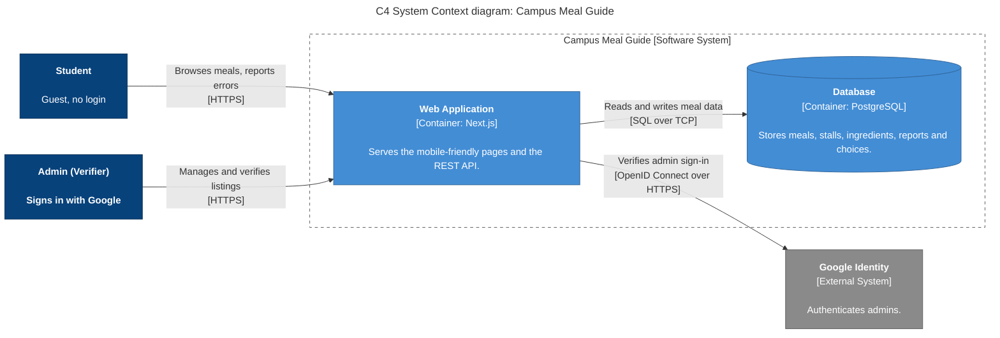

# Diagram 1: C4 System Context, Campus Meal Guide

**Type:** C4 Level 1 (System Context) · **Scope:** the whole system as one box, every user role, and every external system.

## Key

| Shape / colour | Meaning |
|---|---|
| Dark blue box `[Person]` | A human user role |
| Blue box `[Software System]` | The system we are building |
| Grey box `[External System]` | A system we depend on but do not build |
| Arrow | Direction of the request; the label states the intent |

## Notes

- **Vendors are not drawn.** In the MVP they never touch the system. The Admin collects data from them offline.
- **Audience:** instructor, campus partners, and non-technical stakeholders.
- **Risk reduced:** building for the wrong users, or missing an external dependency.
