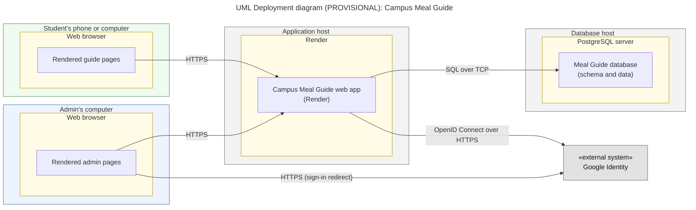

# Diagram 10: UML Deployment (Provisional)

**Type:** UML deployment · **Scope:** nodes, execution environments, and artifacts for the MVP. **Provisional:** the hosting provider is not chosen yet, so generic node names are used.

## Key

| Symbol | Meaning |
|---|---|
| Large box `«device»` or `«node»` | Physical or virtual machine |
| Box inside a node `«execution environment»` | Software that runs the artifact |
| Innermost box `«artifact»` | The file or build that is deployed |
| Labelled arrow | Communication path and its protocol |

## Notes

- This diagram contains no secrets, credentials, or real addresses. Hosting details are filled in once the provider is chosen.
- **Audience:** whoever deploys the system, and the instructor.
- **Risk reduced:** late hosting surprises, such as an exposed database or an unplanned dependency.
