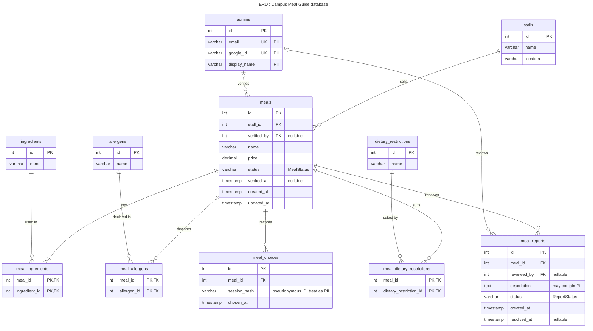

# Diagram 11: Entity Relationship Diagram 
**Type:** ERD, crow's-foot notation · **Scope:** one table per stored class, plus join tables for the many-to-many associations. It is derived from `class.md`.

## Key

| Symbol | Meaning |
|---|---|
| `PK` / `FK` / `UK` | Primary key / foreign key / unique key |
| `\|\|` | Exactly one |
| `\|o` | Zero or one |
| `o{` | Zero or many |
| `\|{` | One or many |
| Comment `"PII"` | Personally identifiable information column |
| `"nullable"` | Value may be empty |

## Notes

- **Cardinality matches `class.md`:** a meal lists one or more ingredients (`||--|{`), while allergens and dietary restrictions may be zero or many.
- **Status columns** hold the values of `MealStatus` and `ReportStatus`.
- **PII columns:** `admins.email`, `admins.google_id`, `admins.display_name`, `meal_reports.description`, and `meal_choices.session_hash`. Student accounts do not exist, so no student identity is stored.
- **Audience:** database developers and whoever handles data privacy.
- **Risk reduced:** a schema that drifts from the class model, or unprotected personal data.
