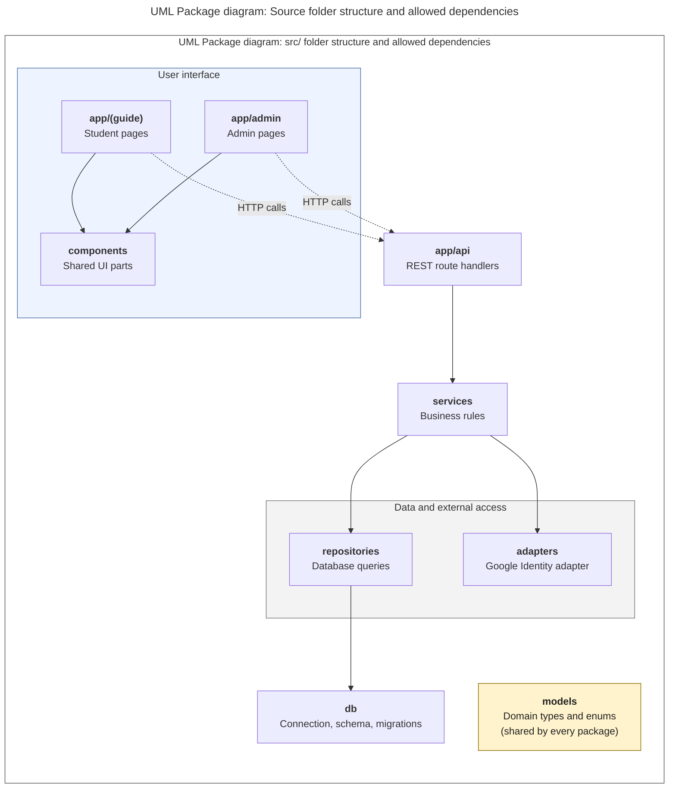

# Diagram 8: UML Package, source folder structure

**Type:** UML package · **Scope:** the folders under `src/` that the team will create, and the allowed dependencies between them. The folder names are **proposed** and should be confirmed by the team.

**Layering rule:** each package may only import from the layer directly below it, so pages never import services or the database layer directly, and the shared `models` package imports nothing.

## Key

| Symbol | Meaning |
|---|---|
| Box | A folder (package) |
| Solid arrow | "Imports from" (compile-time dependency) |
| Dotted arrow | Runtime call over HTTP only, with no import |
| Yellow box | Shared package that every layer may use |

- **Audience:** developers.
- **Risk reduced:** tangled code, such as pages that query the database directly.
