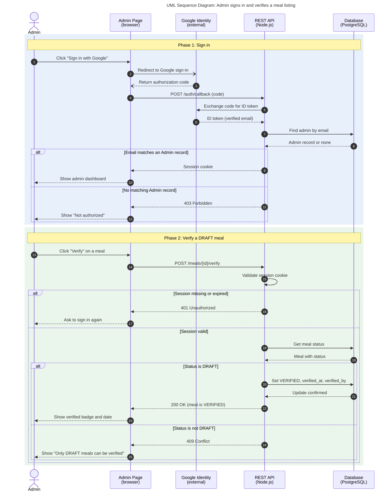

# Diagram 5: UML Sequence, Admin signs in and verifies a meal

**Type:** UML sequence · **Scope:** the riskiest flow. It combines the one external system (Google sign-in), an authorization check, and a status change (DRAFT to VERIFIED).

## Key

| Symbol | Meaning |
|---|---|
| Solid arrow with filled head | Synchronous request |
| Dashed arrow | Reply |
| `alt` / `else` | Alternative branches; only one runs |
| Shaded band | A phase of the flow |

## Notes

- Every call in this flow is synchronous. The MVP has no asynchronous messages, so none are drawn.
- Endpoint paths (`/auth/callback`, `/meals/{id}/verify`) are **proposed** and must match the final API contract.
- **Audience:** front-end and back-end developers.
- **Risk reduced:** unauthorized verification, and invalid status changes found only at integration time.
