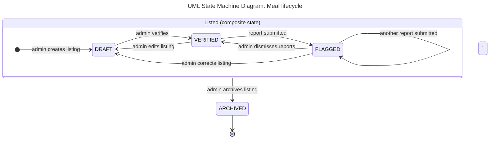

# Diagram 7: UML State Machine, Meal

**Type:** UML state machine · **Scope:** the lifecycle of `Meal`, the entity with a status field. State names match the `MealStatus` enumeration in `class.md`.

## Key

| Symbol | Meaning |
|---|---|
| Filled circle | Initial state |
| Circle with ring | Final state |
| Rounded box | State, named as a condition |
| Large box "Listed" | Composite state grouping DRAFT, VERIFIED and FLAGGED, so one "archives" transition applies to all three |
| Arrow with label | Transition, labelled with the event that triggers it |

## What students see in each state

| State | Visible to students? |
|---|---|
| DRAFT | No |
| VERIFIED | Yes, with the verified badge and date |
| FLAGGED | Yes, with a warning until the admin decides |
| ARCHIVED | No |

- **Audience:** developers and testers.
- **Risk reduced:** illegal status changes, such as an unverified meal shown as safe.
