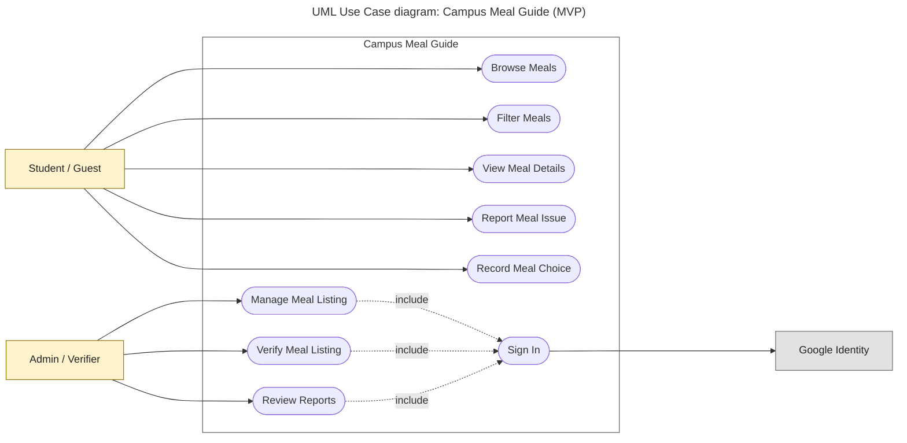

# Diagram 3: UML Use Case, Campus Meal Guide

**Type:** UML use case · **Scope:** every actor from the context diagram and 9 goal-level use cases from the Must-have features.

## Key

| Symbol | Meaning |
|---|---|
| Yellow box | Primary actor (a person) |
| Grey box | Secondary actor (an external system) |
| Rounded shape inside the frame | A use case (verb + object) |
| Solid line | Actor takes part in the use case |
| Dashed arrow `«include»` | The use case always includes the target use case |
| Large frame | System boundary |

## Traceability to the MVP feature list

| Use case | Must-have feature |
|---|---|
| Browse Meals | M1 |
| Filter Meals | M2 and M3 (one use case; diet and price are used together) |
| View Meal Details | M4 |
| Report Meal Issue | M5 |
| Record Meal Choice | M9 |
| Sign In | M6 |
| Manage Meal Listing | M7 (add, edit, archive) |
| Verify Meal Listing | M8 |
| Review Reports | M8 |

- The Admin reaches **Sign In** through the `«include»` of each admin use case, so every admin goal requires a Google sign-in first.
- **Audience:** the team and the instructor.
- **Risk reduced:** building features no actor needs, or missing a Must-have.
